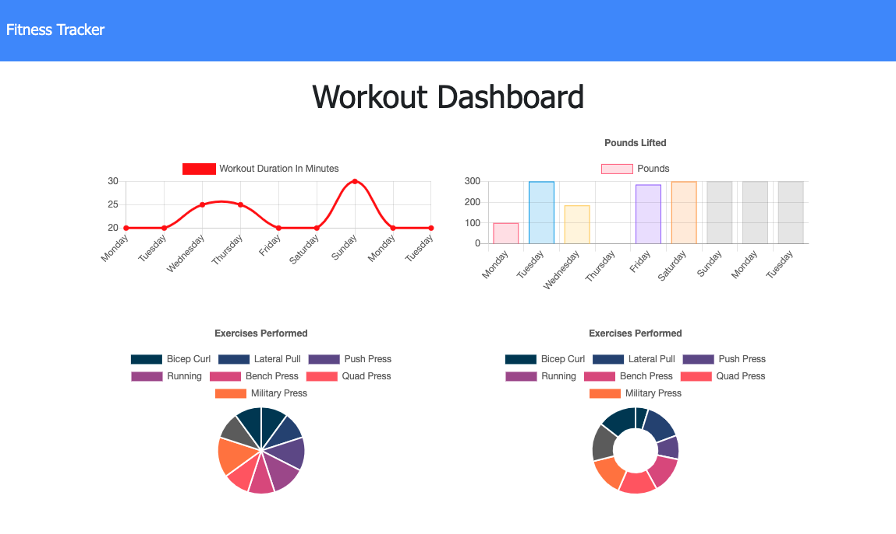

# Workout-Tracker


## Description  
Workout Tracker Application that allows tracking of daily workouts and presents a dashboard with weekly progress charts. This application implement [MongoDB](https://www.mongodb.com/) database with a Mongoose schema and handle routes with [Express](https://www.npmjs.com/package/express). The site is hosted on [Heroku](https://www.heroku.com/).



    
## Table of Contents   
* [User Story](#User-Story)
* [Business Context](#Business-Context)
* [Acceptance Criteria](#Acceptance-Criteria)
* [Installation](#Installation)
* [Usage](#Usage)
* [Credits](#Credits)
* [License](#License)
* [Questions](#Questions)

## User Story

* As a user, I want to be able to view create and track daily workouts. I want to be able to log multiple exercises in a workout on a given day. I should also be able to track the name, type, weight, sets, reps, and duration of exercise. If the exercise is a cardio exercise, I should be able to track my distance traveled.

## Business Context

A consumer will reach their fitness goals more quickly when they track their workout progress.

## Acceptance Criteria

When the user loads the page, they should be given the option to create a new workout or continue with their last workout.

The user should be able to:

  * Add exercises to the most recent workout plan.

  * Add new exercises to a new workout plan.

  * View the combined weight of multiple exercises from the past seven workouts on the `stats` page.

  * View the total duration of each workout from the past seven workouts on the `stats` page.


## Installation
1. Clone the repo.
2. Navigate to the project directory.
3. Run command ```npm install``` to install any dependencies.

## Usage    
* Navigate to [Workout Tracker Site](https://desolate-headland-50731.herokuapp.com/).
* Click on New Workout.
* Pick Workout type.
* Fill Workout Form.
* Click on Add Exercise to add a new exercise.
* Click on Complete to Submit last exercise.
* Click Continue Workout to readd more exercises.
* Click Dashboard to view Weekly Progress.

## Credits  
Developed by: 
Manuel Leung Chen ([GitHub](https://github.com/manuelleungchen))

Deployment Tools used: 
* [Express](https://www.npmjs.com/package/express)
* [Heroku](https://www.heroku.com/)
* [Mongoose](https://www.npmjs.com/package/mongoose)

## License
Copyright (c) 2020 - Manuel Leung Chen

Licensed under the [MIT License](https://choosealicense.com/licenses/mit/).
 

## Questions
Manuel Leung Chen - [GitHub](https://github.com/manuelleungchen )

If you have any question about this application, please reach out me by [Email](manuel.leungchen@gmail.com)

